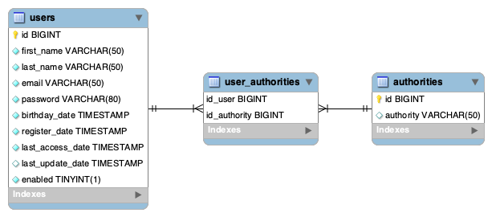

# API Rest CRUD

API Rest CRUD with OAuth2

## Requirements

- Java 11

**Tip:** Install java tools using [SDKMAN](https://sdkman.io).

## Script

There is a script in scripts/___apiRestCrud.sh. to pick up the docker containers, compile and run the server from the terminal.

- In order to make it work we will need the PROJECT_PATH variable with the PATH where the project is located.

```shell
#!/usr/bin/env bash

echo "\nWhat do you want to do?"
echo "1. Remove docker containers"
echo "2. Start docker containers"
echo "3. Compile"
echo "4. Start the server"
echo "5. Compile and start the server"
echo "6. Execute Sonarqube report"
echo "0. Exit"

PROJECT_PATH=~/personal/api-rest-crud/
```

## Sonarqube

The first time we start Sonarqube we must change the password of the following default user:

    sonar.login=admin
    sonar.password=admin

Once the previous step has been done, for greater security, we will have to generate a user token. Finally, we will add it with the
following property inside the ```~/.gradle/gradle.properties``` file:

    systemProp.sonar.login=[User Token]

## EER Diagram

